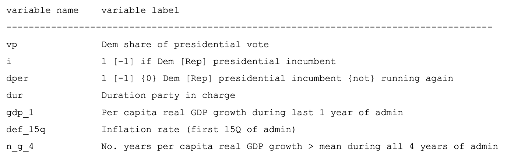
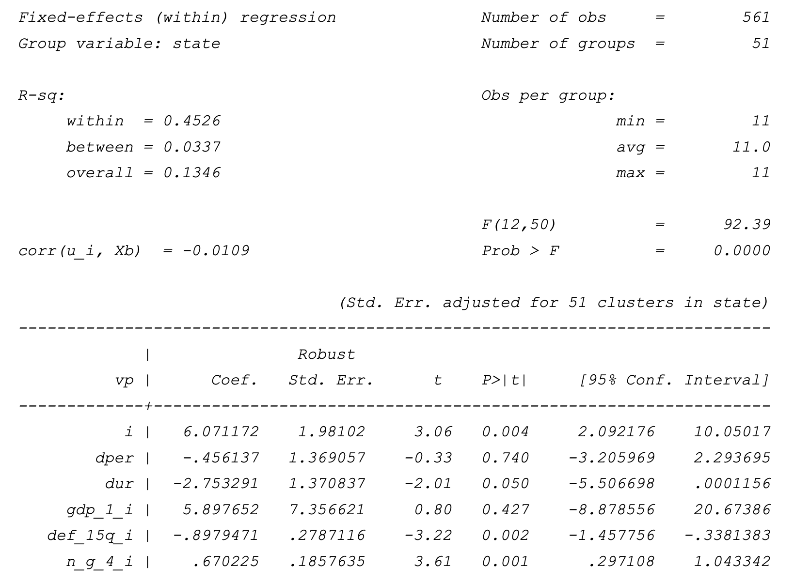
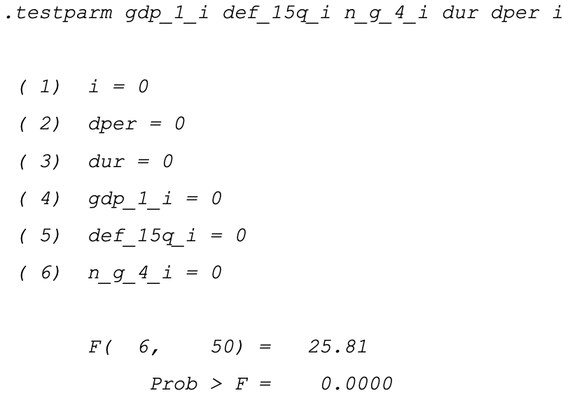
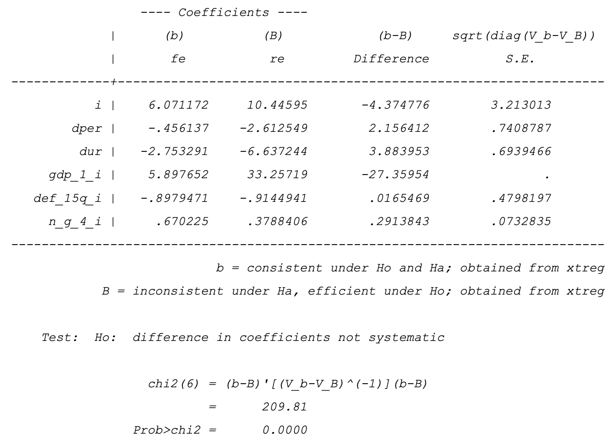
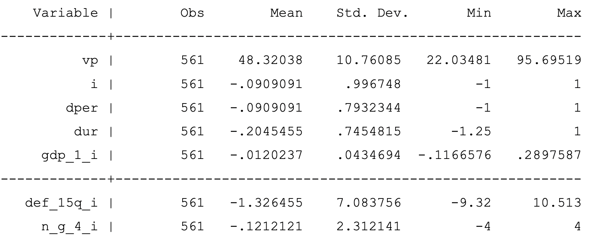
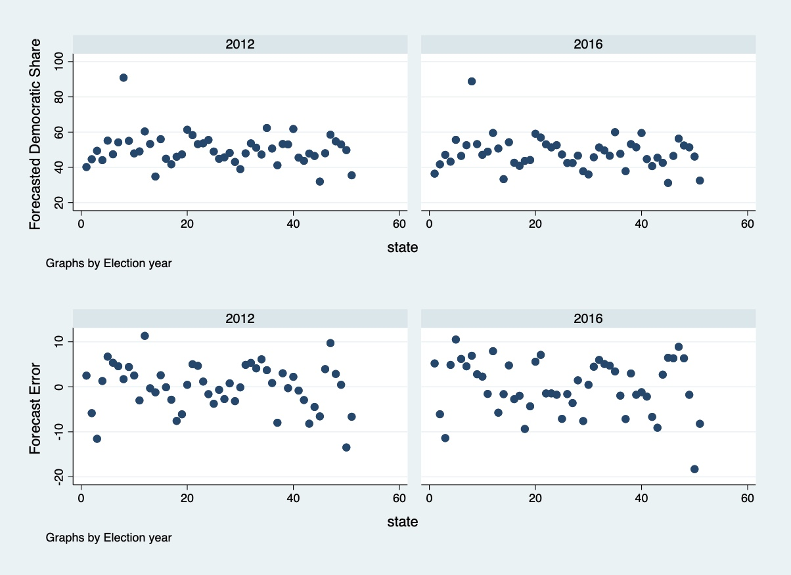
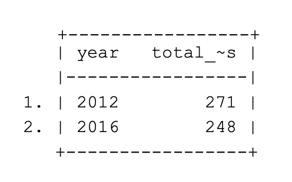
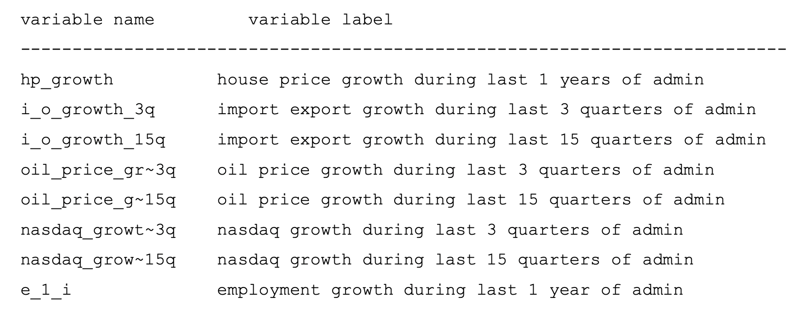
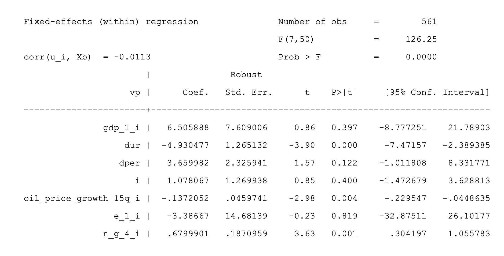
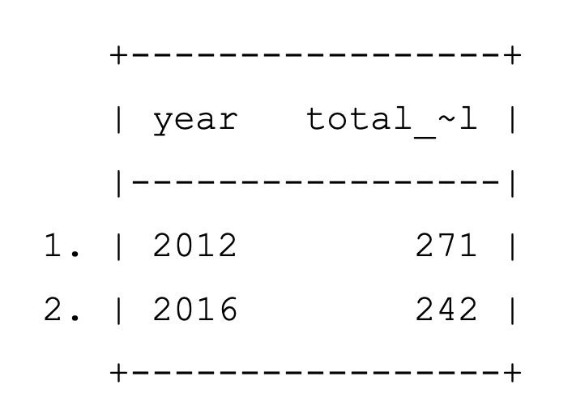

### A Brief Panel Data Analysis to Forecast U.S. Presidential Election

# Abstract
  In this paper I will initially retrace the path marked by Ray C. Fair
  with his long lasting series of presidential elections forecasts
  exploiting the same variables he uses but enriching the model with
  panel data. Exploiting the Fixed Effects estimation I will then add
  new variables that, according to our intuition, could lead to an
  overall improvement of the model and test for them applying the LASSO
  algorithm for model selection. I will finally infer the results and
  explore the possible challenges in disentangling causality from
  correlation.
  
# Exploratory Data Analysis

The historical sample contains 11 previous elections, beginning with the
1976 Ford-Carter contest and the popular vote for each State and the
District of Columbia. The aim is to predict whether the presidential
nominee from the democratic party will win the popular vote in each
state and the District of Columbia. The explanatory variables group a
set of national and state economic conditions in the lead-up to the
election, as well as various quantifiable political variables which we
will able to see in depth later on. Individual state results are then
used to calculate the results of the Electoral College. In the Electoral
College system, the candidate who is able to garner at least 270
electoral votes wins the election. They are all estimated as pooled
regressions with fixed effects that are designed to capture
state-specific preferences of the electorate to vote for the incumbent
party. The explanatory variables in our model specifications can be
divided into two groups: politics and economics. Although economics are
critical to deciphering the behaviour of the marginal voter and thus
usually the outcome of the election, political variables remain the most
potent for predicting the large majority of votes on a state-by-state
basis. Dur and Dper are "fatigue" variables measuring how long the
incumbent party has been in office and if the incumbent president
belongs to one or the other party. History shows us that voters are
loath to allow one party, Democrat or Republican, to remain in power for
more than two consecutive terms. I represents the incumbency itself and
it is useful to give credit to the incumbent president for every
estimate. Then we have Per capita real GDP growth during last 1 year of
administration and the number of years with per capita real GDP growth
above the mean during all 4 years of administration. Finally we add the
inflation rate for the first 15 quarters of administration based on the
GDP deflator.

# Estimation

{#fig:graph1
width="0.8\\linewidth"}

With fixed effects models, we do not estimate the effects of variables
whose values do not change across time. Rather, we control for them or
"partial them out." This is similar to an experiment with random
assignment. It may be assumed to be more or less the same across groups
because of random assignment.

It makes sense to use the fixed-effect model if two conditions are met.
First, we believe that all the studies included in the analysis are
functionally identical. Second, our goal is to compute the common effect
size for the identified population, and not to generalise to other
populations. A fixed group effect model examines individual differences
in intercepts, assuming the same slopes and constant variance across
individual (group and entity). Since an individual specific effect is
time invariant and considered a part of the intercept, $u_i$ is allowed
to be correlated.

Fixed effects models control for, or partial out, the effects of
time-invariant variables with time-invariant effects. A parameter
estimate of a dummy variable is a part of the intercept in a fixed
effect model.

{#fig:est_1}

# Estimation

From a first overview we can see that the null hypothesis that a Pooled
OLS would represent a better model is rejected, that the "within" $R^2$
reaches a fairly 0.45 value and that the correlation between the error
term and the regressors is fairly low. Finally we could spot how
variables such as Gdp, Dper and Dur seem to be not statistically
significant but that doesn't really have to bother us since we should
evaluate an econometric model like this one as a whole by a joint
significance F-test, which in fact, does reject the null hypothesis that
the coefficients are jointly not significant.

{#fig:est_1}

We could further proceed by performing an Hausman test to make sure the
Fixed effect model is the best option we have. If the null hypothesis
that the individual effects are uncorrelated with the other regressors
is not rejected, a random effect model is preferred over its fixed
counterpart.

{#fig:est_1}

In our case, we can significantly reject the null hypothesis and keep
going with forecasting 2012 and 2016 presidential elections results with
our Fixed Effects model. What we can tell about the coefficients is that
for what it concerns the trio I, Dper and Dur, they have the weight we
were expecting to have, confirming the American people's attitude to
generally favour the reelection of a President after the first term
election but strongly supporting the party shift after two consecutive
terms of incumbents of the same party. For what it concerns the real per
capita GDP growth of the 4 quarters of the election year, that value of
5.89 says that it could lead up to (if we take the maximum value of
*GDP* from figure 5) a $0.289*5,89 = 1,70$ percent point more in popular
votes for the incumbent party that provides a strong growth.
Coefficients of the inflation rate in the the last 15 quarters and
number of strong growth quarters are also consistent with our
expectations about them providing up to a 10\*0.89 = 8.9 percent point
less when it grows for inflation and up to a 0.67\*4 = 2.68 percent
point more for a constantly over-the-mean 4 years term. Inflation effect
seems pretty high but it is actually plausible if we think that seeing
prices going up or down is the first thing an average American daily
notice and that impacts his/her life.

{width="40%"}

In Figure 6 we can graphically see the forecast of the democratic party
share of the vote for each state and the forecast errors that stay in
$\pm 10\%$ error interval. After calculation of In figure 7 we can
visualise the number of Grand Electors forecasted for the democratic
party on federal level.

In 2012 Barack Obama won the elections conquering 332 Grand Electors
while in 2016 Hilary Clinton lost with only 227 Grand Electors although
she won the popular vote.

{#fig:est_1}

Our forecast correctly assigned the presidency to both Obama and Trump
although it underestimated the 2012 victory by 61 electors and
overestimated the result of the democratic party in 2016 by 21 electors.
This simple model undoubtedly fails to account for many hardly countable
factors such as the candidate's personality, the international
atmosphere and the underlying population sentiment. It does fail to
account for different and new communication methods and styles and for
many other factors which are often central to determine the next
American President.

{#fig:my_label}

Now we can further proceed to improve our model by adding new variables
that should, in our own opinion, be significant and then applying the
LASSO algorithm to formalise the model selection of the features. We are
going to introduce the following variables to be considered (Figure 8).

{#fig:est_1}

The Least Absolute Shrinkage and Selection Operator (LASSO) finds the
coefficients that minimize the sum of squared errors in the regression
equation with an additional penalty term that penalizes the size of the
model through the sum of absolute values of the coefficients. However,
naively using the results obtained from such procedure to draw
inferences about model parameters can give biased estimate, hence we
should always be careful when using Lasso selection because a Naive post
selection approach would inevitably lead to unreliable inference. When
some of the covariates have small coefficients, the distribution of the
covariate-selection method is not sufficiently concentrated on the set
of covariates that best approximates the process that generated the
data. Covariate-selection methods will frequently miss the covariates
with small coefficients causing omitted variable bias so the random
inclusion or exclusion of these covariates causes the distribution of
the naive post-selection estimator to be not normal. I will use in this
case a Double selection estimator using cross validation to choose the
value of the penalty $\lambda$.

{#fig:est_1}

In Figure 9 we can spot the variables chosen by LASSO and the estimates
of the coefficients for our new Fixed Effect model. In conclusion the
Lasso algorithm chose for our regression two new variables, employment
growth during last 1 year of administration and the oil price growth
during last 15 quarters of administration while instead the deflator
variable was dropped. The Oil price growth is likely to have substituted
inflation in the coefficient because, as the latter, it is something
very tangible in the daily life of the average American citizen and from
its price going up and down the American citizen will probably draw its
conclusions on the economic health of the nation.

{width="30%"}

Forecasting the Presidential Elections of 2012 and 2016 we can spot that
the difference between the LASSO model and the original model is
minimal; nearly identical apart for the results of 2016 which forecast a
loss with 242 grand electors instead of 248, getting then closer to the
true value.

# Conclusions

Our expectations on the Lasso model were not that different from what it
turned out to be. Adding new interesting and relevant economic variables
won't improve the model for the simple reason that the variables
directly impacting the life of the American citizens were already in the
model, and after a certain degree of complexity they become each other
"alternative" for a naive estimation of the economic realty by the
average citizen. To marginally improve the model we would need a more
complex and deep qualitative analysis which, as stated before, accounts
for hardly countable factors which are often at the core of the
decisions that determine the following American President.

# Causal Inference

One of the most relevant challenge concerns the definition of control
and treatment groups. In natural experiments we don't always have a
clear distinction between the two groups as we would have in a lab
experiment and we need to cope with this. In our case the problem is
that although the U.S. elections impacts at the same moment in time all
fifty states, the federal structure of the Nation imposes a certain
degree of freedom across states that makes the evaluation of controls
and treatment groups either problematic or handy. Policies, laws and
large scale programs don't usually get applied simultaneously in all of
the 50 states and that could lead invoking methods such as Difference in
difference (DD). This method is typically used to estimate the effect of
a specific intervention or treatment by comparing the changes in
outcomes over time between a population that is enrolled in a program
(the treated group) and a population that is not (the control group). We
need to recall, though, that methods like diff-in-diff does not identify
the treatment effect if treatment and comparison groups were on
different trajectories prior to the program, making the complex
heterogeneity between all the American states (population density, level
of education, real per capita GDP, etc..) an incredible challenge for
researchers. A possible solution to this problem could be Geographic
Regression Discontinuity design, where the analyst compares units close
to a border that separates adjacent treated and control areas but again,
obstacle that researchers may face when using geographic variation to
make causal inferences is that it might be difficult to separate the
effect of the treatment of interest from other features of the
geographic unit. That is, the Compound Treatment Irrelevance Assumption
may not be very compelling in many contexts (Keele & Titiniuk, 2011).
Modelling federal policy on the basis of a small subset linked to the
their geographic particularity could surely lead to significant
conclusion but at the price of a low external validity, as is always the
case in local econometric strategies based on policy discontinuities.
Another challenge we can expect is the one related to the
disentanglement of causation from correlation. where one of the
challenges was to distinguish the effect of the introduction of fiscal
rules per se from the effect given by the goodness of the authorities
that needed to commit to those rules and of the citizens that needed to
follow their authorities. In our case we would want to distinguish the
effect of the political colour of the winner per se from the effect
given by the different aspects that affected the population political
preferences and consequently the winner of the elections. r the other
challenges we could try to apply the same approach discussed in the
paper, called difference in discontinuity, even if in our case we may
find the application a lot more complex. The cause of this complexity
still lies in the heterogeneity between different states of the
federation, where different correlations may apply based on the
dissimilarities that we can found in their voters. Correlation does not
imply causation, we know it, but often the seek and need for answers and
rapid solutions lead to crucially ignoring this statement. When we have
to deal with Federal and local politics this tends to be the rule, not
the exception and policies are implemented often superficially if not
ignoring the complexity of the dynamics net at all. Especially for this
reason we need to carefully manage the subtle relation between such a
harmful couple, correlation and causation, which can undermine the
validity of causal inference and conclusions. Drawing valid causal
inferences on the basis of observational data is not a mechanistic
procedure but rather always depends on assumptions that require domain
knowledge and that can be more or less plausible. However, this caveat
holds not only for research based on observational data, but for all
empirical research endeavours.

100 https://fairmodel.econ.yale.edu/RAYFAIR/PDF/2018B.pdf MIT Election
Data and Science Lab, 2017, \"U.S. President 1976-- 2016\",
https://doi.org/10.7910/DVN/42MVDX, Harvard Dataverse, V5 (Additional
information here: https://electionlab.mit.edu/data) Bureau of Economic
Analysis Belloni, Alexandre, Victor Chernozhukov, and Christian Hansen.
2014. \"High-Dimensional Methods and Inference on Structural and
Treatment Effects.\" Journal of Economic Perspectives, 28 (2): 29-50.
Keele, L., & Titiunik, R. (2015). Geographic Boundaries as Regression
Discontinuities. Political Analysis, 23(1), 127-155.
doi:10.1093/pan/mpu014
